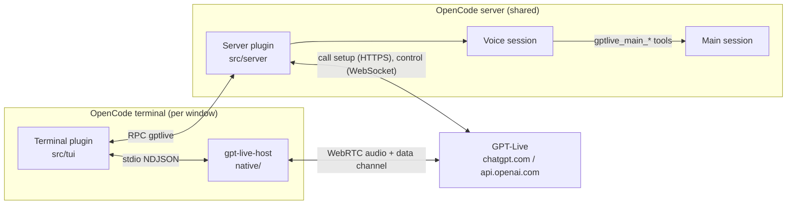

# Architecture

opencode-gpt-live is one npm package with three parts: a server plugin, a terminal plugin, and a native audio helper.
This guide explains what each part owns, how a call flows through them, and the constraints that shaped the design.



## Repository map

| Path                      | What lives there                                                                             |
| ------------------------- | -------------------------------------------------------------------------------------------- |
| `index.ts`                | Server plugin entry.                                                                         |
| `tui.ts`                  | Terminal plugin entry. The only file that imports `@opentui/core` at runtime (see below).    |
| `src/shared/rpc.ts`       | The `GptLive` RPC contract between the two plugins: methods, events and their schemas.       |
| `src/server/index.ts`     | Server plugin: tools for the voice agent, the call lifecycle, voice-session continuity.      |
| `src/server/live.ts`      | The GPT-Live wire contract: call creation, headers, the control WebSocket and its events.    |
| `src/server/bridge.ts`    | Connects GPT-Live to OpenCode: hand-offs, coding-session updates, permissions, ending calls. |
| `src/server/prompt.ts`    | Loads the system prompts: built-in section folders, user overrides, placeholders.            |
| `src/server/prompts/`     | The prompts for GPT-Live and the voice agent, one Markdown file per section.                 |
| `src/server/context.ts`   | Conversation history quoted as data, and agent text made speakable.                          |
| `src/server/auth.ts`      | Reads OpenCode's ChatGPT OAuth sign-in.                                                      |
| `src/server/log.ts`       | The per-call JSONL log.                                                                      |
| `src/tui/index.ts`        | Terminal plugin: commands, keys, slots, starting calls.                                      |
| `src/tui/controller.ts`   | Call state machine in the terminal, helper lifecycle, RPC events, heartbeats.                |
| `src/tui/helper.ts`       | Finds, downloads (with checksum verification) and drives the native helper.                  |
| `src/tui/ui.ts`           | The status strip, transcript panel, aura view, footer badge and the frame clock.             |
| `src/tui/aura.ts`         | The aura renderer: RGBA frames from voice level and speaker.                                 |
| `src/tui/surface.ts`      | Where frames are shown: kitty graphics, herdr's graphics API, or half-block text.            |
| `src/tui/herdr.ts`        | herdr's `pane.graphics.stream` client.                                                       |
| `native/src/main.rs`      | Helper entry and command loop.                                                               |
| `native/src/transport.rs` | WebRTC peer: SDP offer/answer, Opus RTP, the data channel.                                   |
| `native/src/audio/`       | Devices (CPAL), resampling, echo cancellation and noise suppression (sonora), Opus.          |
| `native/src/duck.rs`      | Turning other apps' audio down during calls, per operating system.                           |
| `scripts/`                | Release packaging, the headless end-to-end call, and the README aura renderer.               |

## Life of a call

1. **Start.** `/voice` (or the key) runs `start()` in `src/tui/index.ts`. With no session open, it creates one and
   waits for its prompt to mount. The transcript panel opens.
2. **Helper.** The controller locates `gpt-live-host` (platform package, cache, or local build; otherwise it downloads
   the release asset and checks `SHA256SUMS`), spawns it and sends `start`. The helper opens the microphone and
   speaker, starts ducking other apps, creates the WebRTC peer and replies with an SDP `offer`.
3. **Call setup.** The controller calls the server plugin's `start` RPC with the offer. The server resolves the ChatGPT
   sign-in, finds or creates the voice session linked to this main session, and posts the offer and the session
   configuration to GPT-Live's calls endpoint. The response carries the SDP answer and the call ID.
4. **Connect.** The controller passes the answer to the helper (`answer`). Audio flows. In the background the server
   joins the call's control WebSocket and starts the bridge.
5. **Talking.** GPT-Live transcribes and replies in real time. Transcripts reach the panel as RPC `transcript` events.
6. **Hand-offs.** When GPT-Live needs to think or act, the bridge sends a message to the voice session. Each hand-off
   contains `<conversation_since_last_message>`, `<coding_session_updates>` (what the main session did since the last
   hand-off) and `<request>`, plus `<call_started>` on the first one of a call. The voice agent answers in the first
   person; its reply goes back to GPT-Live to be spoken.
7. **Work.** The voice agent's tools act on the main session implicitly (its ID is never in the prompt):
   `gptlive_main_send` (queue or steer), `gptlive_main_status`, `gptlive_main_read`, `gptlive_main_stop`,
   `gptlive_main_permissions`, `gptlive_main_permission_reply` and `gptlive_end_call`. They are hidden from every other
   session. Permission requests in the main session are spoken to the user as they arrive.
8. **End.** The user says "end the call" (the voice agent calls `gptlive_end_call`), runs `/voice`, or presses the
   key. The server closes the bridge and control channel and emits `closed`; the controller closes the helper, which
   restores other apps' audio.

### Robustness

- **Heartbeats.** The OpenCode server is shared by every window. The controller sends `alive` every 5 seconds; the
  server ends any call whose window has been quiet for 20 seconds, so a crashed or killed window never leaves a call
  running.
- **Takeover.** Starting a call while another is active ends the old one instead of refusing.
- **Continuity.** Plugin storage keeps `link/<mainSessionID>` (the voice session and call count) and
  `turns/<voiceSessionID>` (the last turns, replayed as background at the next call). `/voice-new` starts a fresh
  voice session.

## The native helper

`gpt-live-host` exists because WebRTC with echo cancellation needs real-time audio threads, which a TypeScript plugin
cannot provide. It holds no credentials: the plugin exchanges the SDP offer for an answer and hands the answer back.

### Protocol

Newline-delimited JSON on stdin and stdout (`native/src/protocol.rs`).

| Commands (plugin → helper)               | Events (helper → plugin)                                   |
| ---------------------------------------- | ---------------------------------------------------------- |
| `start { input?, output?, duckOthers? }` | `ready { version, protocol }`                              |
| `answer { sdp }`                         | `audio { input, output }` (device names and formats)       |
| `mute { muted }`                         | `offer { sdp }`, `connected`, `peer`                       |
| `clear` (drop queued speaker audio)      | `levels` (microphone and speaker levels for the UI)        |
| `devices`                                | `event { data }` (GPT-Live data-channel messages)          |
| `close`                                  | `muted`, `devices`, `warning`, `error { fatal }`, `closed` |

`input` and `output` accept `{ "file": "path.wav" }` for headless testing, and `output` also accepts `"none"`.

### Audio pipeline

```text
Capture:  device rate -> 48 kHz -> echo cancellation, noise suppression (high), high-pass filter, gain (10 ms) -> Opus (20 ms) -> RTP
Playback: RTP -> Opus decode (48 kHz) -> device rate -> speaker ring (60 ms prebuffer)
```

The rendered speaker signal feeds back as the echo-cancellation reference, which is what makes speakers usable
without headphones.

### Ducking

| OS      | Method                                                                                                                                 |
| ------- | -------------------------------------------------------------------------------------------------------------------------------------- |
| macOS   | A voice-processing I/O unit with maximum "other audio" ducking, the mechanism FaceTime uses. It ducks audio from other processes only. |
| Windows | Every other app's audio session volume drops to 20%, like the Volume Mixer sliders.                                                    |
| Linux   | Every other PipeWire/PulseAudio playback stream drops to 20%, via `pactl`.                                                             |

On Windows and Linux, streams that start during the call are lowered too, and a stream is restored only if its volume
is still what the helper set.

## The terminal UI

The UI is built imperatively from OpenTUI renderables and redrawn by a frame clock (`Frames` in `src/tui/ui.ts`). Two
constraints drive this:

- **One runtime copy of OpenTUI.** OpenCode maps runtime packages such as `@opentui/core` to its own copies only for
  imports in the plugin's entry file. `tui.ts` imports the module and passes it in through `createTuiPlugin(core)`;
  every other file uses type-only imports and `core()` from `src/tui/core.ts`. Importing `@opentui/core` anywhere else
  would create renderables from a second copy that the host cannot draw.
- **No JSX.** For the same reason the UI does not use Solid; views are plain objects with `update(now)`,
  `animating(now)` and optional `interval()`, `suspend()` and `dispose()`.

The frame clock runs only while something animates, at the fastest interval any animating view asks for (33 ms for
the aura).

### The aura

`AuraCanvas` (`src/tui/aura.ts`) draws a ring woven from four translucent strands. Per frame it computes each strand's
radius, width and colour for 720 angle buckets, then shades only the pixels near the ring, so a 192 × 192 frame
takes about 2 ms. Your voice gives fine, quick ripples spinning one way in cyan; GPT-Live gives broad, slow swells
spinning the other way in violet. The level driving it is smoothed with a 40 ms attack and 200 ms release.

`pickSurface` (`src/tui/surface.ts`) chooses how to show it:

| Surface  | When                                             | How                                                            |
| -------- | ------------------------------------------------ | -------------------------------------------------------------- |
| `herdr`  | `HERDR_ENV=1`, not inside tmux, screen or Zellij | RGBA frames over herdr's `pane.graphics.stream` socket, 30 fps |
| `kitty`  | The renderer reports kitty graphics              | Kitty graphics commands over an empty slot, 30 fps (see below) |
| `blocks` | Everywhere else                                  | Half-block characters, rendered at 3× and averaged down        |

The kitty surface (`src/tui/kitty.ts`) does not use OpenTUI's `ImageRenderable`, which clears the cells under an image
to the terminal's default background: with a translucent terminal, every late frame flashed a see-through square. It
reserves the cells with an empty box instead, so they keep the panel's background, and writes the kitty commands
through the renderer's output queue (`writeOut`, which OpenTUI uses for its own control sequences but does not type as
public).

Each frame is zlib-compressed RGBA, sent in chunks and placed at the slot's cell under the other of two alternating
image IDs; the previous image is deleted only after the new one is placed. (Retransmitting an ID would delete its
placements first, leaving the aura blank during a slow upload.) The cursor is saved and restored around each frame, all
inside one synchronized update, so it never visibly moves. Frames use the terminal's real cell size, capped at 65,000
pixels. The image is placed only once the slot's position has held for a frame, and deleted when the aura hides.
Without `writeOut`, the aura falls back to half-blocks.
